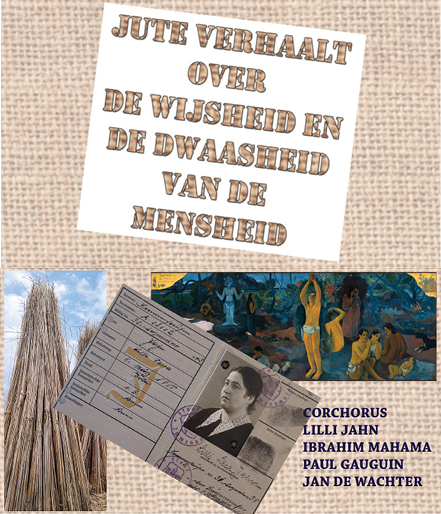

## Wat

Een _levensbeschouwelijke en narratieve performance_ bestaat uit de vertelling van **Het Verhaal van Jute** over de wijsheid en de dwaasheid van de mensheid. 

## Programma

Het verhaal bestaat uit drie delen: **Corchorus - Lilli Jahn - Jute Art**. Het verhaal wordt ononderbroken vertelt en duurt circa 75 minuten. Het verhaal is omkaderd met enkele aangepaste rekwisieten en beelden. 

## Wie

Sylvain De Bleeckere creëerde het verhaal en vertelt het tijdens de narratieve performance met een levensbeschouwelijk karakter.

## Thema's

De naam van het hoofdpersonage verwijst naar **de vezelplant corchorus**, grondstof voor de stof jute. Ze is ontdekt en gecultiveerd in Zuid-Oost Azië en heeft _unieke en waardevolle biologische_ eigenschappen. De waarde van de plant is in het Westen ontdekt tijdens de Industriële Revolutie van de negentiende eeuw en ze speelt nu opnieuw een hoofdrol in de strijd tegen _ecologische vervuiling van onze planeet Aarde en voor fairtrade_. Het verhaal van Jute onthult een deel van de wijsheid van de mens. Die wijsheid kan ieder ogenblik verloren gaan. Dat leert Jute die het verhaal vertelt van **Lilli Jahn**, de Duits-Joodse moeder en arts die de _Holocaust_ niet heeft overleefd. Ook in haar verhaal speelt jute een hoofdrol. Over de afgrond van de dwaasheid van de mensheid legt Jute in haar verhaal een fragiele brug naar de herontdekking van de wijsheid van de mens. Het is een brug van jute, ontworpen door **de hedendaagse levensbeschouwelijke jutekunst** van _Paul Gaugain, Ibrahim Mahama, Jan De Wachter_.

## Uitvoeringen

**28 augustus 2018**: De try-out vond plaats op zaterdag 25 augustus 2018 in de Heilig-Magdalenakerk (Brugge) tijdens het [Project Agora](http://www.menstis.be/producties/Agora/). 

## Programmeren 

De voorstelling kan worden geprogrammeerd in locaties die een zekere huiselijke en bezinnende sfeer uitstralen voor een publiek vanaf tien jaar. De grootte van de groep is maximum 50 personen. Indien interesse, neem vrijblijvend contact via: **info@menstis.be**.

