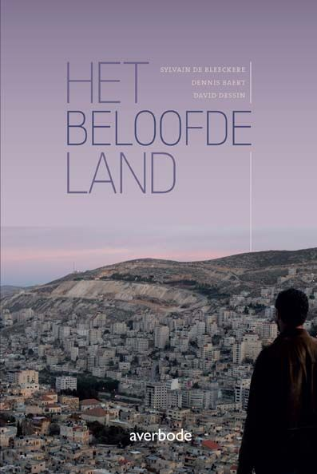

**Auteurs**

Sylvain De Bleeckere, Dennis Baert, David Dessin

**Beschrijving**

Het boek handelt over het Bijbelse gegeven van het Beloofde Land. Het eerste deel,
**Het Beloofd Land in Woord**, behandelt 
het Bijbelse narratief van het Beloofde Land **exegetisch** (Dennis Baert). Daarna volgt het onderzoek hoe het narratief
van het Beloofde Land als **Joods vraagstuk in de diaspora** doorwerkt (David Dessin). Het tweede deel, Het Beloofde Land 
in Beeld (Sylvan De Bleeckere), behandelt **het Beloofde Land en de staat Israël**. Dit hedendaags perspectief krijgt inhoud
via drie langspeelfilms _Hannah Arendt_ (Margarethe von Trotta), _Inch'Allah_
 (Anais Berbeau-Lavalette) en _The Attack_ (Zias Doueiri). 

**Doelgroepen**

> Al wie wil reflecteren over het Bijbelse gegeven van 'het beloofde land', rekening houdend met de studie van de Bijbelse teksten en het hedendaagse joodse denken daarover.

>Al wie de actualiteit van Israël en het Midden Oosten niet onberoerd laat.

> Al wie oogt heeft voor de doorwerking van de actuele toestand in het Bijbelse 'beloofde land' in enkele, relevante hedendaagse films. 

**Technische gegevens**

Het betreft **een studieboek**, academisch onderbouwd en gericht
naar een publiek dat tijd wil nemen om lezend en schouwend na te denken vanuit een open geest. 
Het boek telt **118 bladzijden en 10 beelden**.  
De **afmetingen** van het boek zijn: D: 1 cm, B: 14 cm, H: 21 cm.   
Het boek verscheen in **2014** naar aanleiding 
van _De Dag van de Religieuze Film_ 
rond het gelijknamige thema en met de drie films die in het boek worden belicht. 
   
De uitgever is **Altiora Averbode**, Averbode. 
ISBN: 978 90 317 3792 5 

Het boek is verkrijgbaar aan 10,00 EUR - portkosten niet meegerekend - via: info@menstis.be.

© Men(S)tis, 2020.