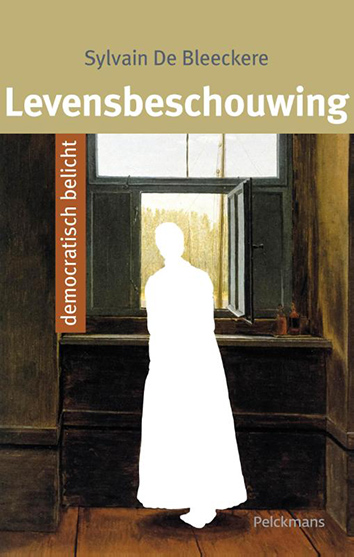

**Auteur**

Sylvain De Bleeckere

**Beschrijving**

Het boek vormt **de syntese en de verdieping** van het jarenlange onderzoek van de auteur naar de relatie
tussen de filosofie van het leven tot de cultuurfenomenen kunst en religie en het antoropologisch fenomeen
 van **de zingeving** in het perspectief van **de postmoderne, naoorlogse en democratische samenleving**. 
Het bestaat uit drie delen: **Praxis van het contemplatievermogen, Het grote vergeten, De Lichtaard**. 
Het boek zondert het fenomeen levensbeschouwing af tegenover dat van **het wereldbeeld** en **de Ideologie**. 
Het boek vertelt het verhaal van de **Europese, westerse cultuur** vanuit **het Atheeense experiment** van de democratie met het ontstaan van het theater
en de kunst van de tragedie. Het belicht in die optiek ook **het toeschouwerschap** van de mens. 

**Doelgroepen**

> Al wie ernstig wil nadenken over onze westerse cultuur en beschaving.

> Al wie de impact inziet van het moderne fenomeen 'ideologie'.

> Al wie zich buigt over het fenomeen 'levensbeschouweing' in een democratisch, actueel perspectief.

> Al wie belangstelling toont voor de kunst van de tragedie en haar doorwerking in de kunst van de cinematografie.

> Al wie meedenkt over een herijking van de betekenis van 'religie'.

> Al wie actief is in de studie van de filosofie en de godsdienstwetenschappen en theologie, alsook in het onderwijs, vooral in de lessen algemene vakken.

 >Al wie politiek geëngageerd is.

**Technische gegevens**

Het betreft **een studieboek**, academisch onderbouwd. 
Het boek telt **304 bladzijden en 5 beelden**.  
De **afmetingen** van het boek zijn: D: 2,5 cm, B: 15 cm, H: 23,5cm.   
Het boek verscheen in **2015** naar aanleidng van het jubeleum van De Dag van de Religieuze Film en het emeritaat van de auteur.   
De uitgever is **Pelckmans**, Kalmthout. 
ISBN: 978 90 289 7914 7 

Het boek is nog verkrijgbaar via: info@menstis.be.

Het boek kost 20,00 Eur, portkosten niet inbegrepen.

© Men(S)tis, 2020.