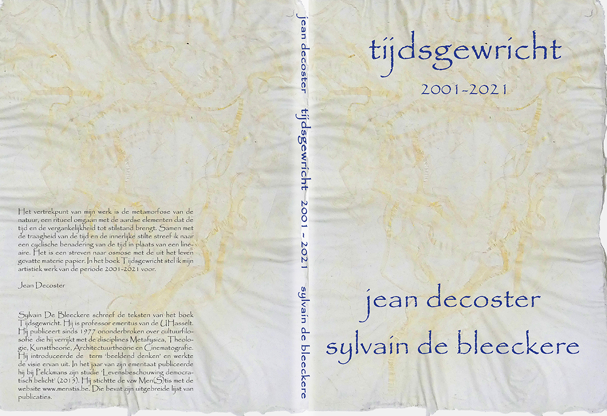

**Auteur**

Sylvain De Bleeckere in nauwe samenwerking met Jean Decoster

**Beschrijving**

TIJDSGEWRICHT is een hybrideboek. Het combineert op een unieke wijze beeld en woord. Het beeld bestaat concreet uit meer dan honderd hoogwaardige beelden die een overzicht geven van **het artistieke werk dat de Tiense kunstenaar Jean Decoster** heeft gerealiseerd in de periode 2001-2021. Toen bestond zijn grondstof uit vezels en cellulose van planten, vooral van kozo, de plant waarvan het Japanse papier wordt gemaakt, hedera helix (klimop), equisetum telmateia (reuzenpaardestaart), urtica dioica (brandnetel), (aspargus planta, aspergeplant), ginkgo biloba (ginkgo).Tegelijkertijd bestaat het boek uit **een uitgebreide tekst van auteur Sylvain De Bleeckere**. De tekst is ontstaan uit een zeer intense dialoog tussen de auteur en de kunstenaar in de loop van het jaar 2021, het tweede coronajaar. De titel van het tekstdeel luidt: *Tijdsgewricht en tijdsreliek. De kunstzinnige alchemie van Jean Decostere*. De indeling van de zes hoofdstukken van de tekst bepalen ook de indeling van de presentatie van de kunstwerken. Ieder hoofdstuk opent met een representatief werk waar de auteur uitvoerig aandacht aan besteedt. Doorheen de hoofdstukken weeft de auteur een spanningsboog die in crescendo uitmondt in het zesde hoofdstuk, *Postscriptum: Zelfportret*. De thema’s die de auteur in dialoog met het oeuvre van Jean Decoster belicht, zijn: tijd, verwevenheid en metamorfose, creatieve zorg om de aarde, dood en leven, hedendaagse kunst als ritueel met een spirituele, bijna mystieke diepgang. De verwevenheid van beeld en woord, van kunst en beschouwing, maken van het omgaan met het boek een intieme, levensbeschouwelijke reis..

**Doelgroepen**

>Al wie levensbeschouwelijk actief is.

>Al wie zich graag confronteert met hedendaagse kunst.

**Technische gegevens**

Het boek heeft een A4-formaat. 
Het boekje telt 168 bladzijden. Het concept, de tekst en de lay-out zijn van Sylvain De Bleeckere. 
Het is een gemeenschappelijke uitgave van Ductus, Tienen, en Men(S)tis, Hasselt, 2022.
ISBN: 978 90 805 1657 1.

Kostrpijs: 32,00 EUR

TIJDSGEWRICHT is niet te koop in de boekhandel. Het is verkrijgbaar via jean.decoster@skynet.be.

© Men(S)tis, 2022.